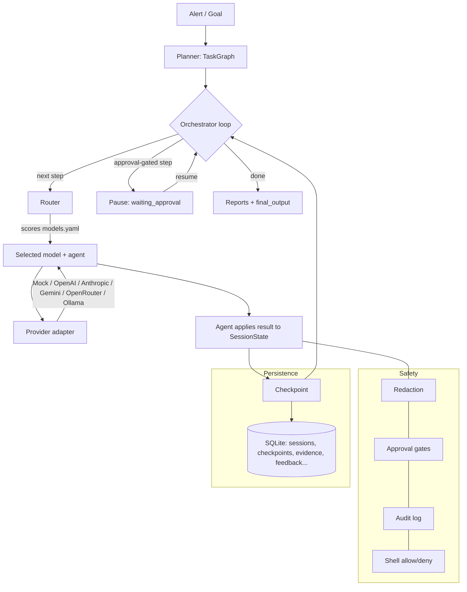

# AEGIS — Multi-AI Blue Team Orchestrator

> Local-first, defensive-security orchestration. AEGIS decomposes a SOC task,
> routes **each subtask to the single best AI model/agent**, checkpoints after
> every step, and produces analyst-grade output. It **runs end-to-end with
> zero API keys** using a deterministic MockProvider, and real providers slot
> in without changing orchestrator/router/agent logic.

This is **not** a "send the same prompt to 5 models and compare" tool. It picks
the best model *per step* — e.g. triage with one model, enrichment with
another, a privacy-sensitive summary with a local model — all against one
canonical `SessionState`.

This is a **defensive** tool: read-only by default, no offensive capability,
no destructive actions without explicit human approval. See
[SECURITY.md](SECURITY.md).

---

## What it does (blue-team use cases)

- SOC alert investigation (intake → triage → enrichment → timeline → analysis
  → response recommendation → report)
- Detection engineering (Sigma, Splunk SPL, Sentinel/Elastic KQL,
  LogScale/Humio CQL, Wazuh, Suricata/Snort, YARA)
- SIEM query generation across platforms
- Threat-intel enrichment (local-first; external sources optional & gated)
- IOC extraction, log normalization, timeline building, MITRE ATT&CK mapping
- Incident response planning (containment / eradication / recovery / lessons)
- True/false-positive classification, root-cause analysis
- Case & evidence management with chain-of-custody
- SOC / analyst / executive / customer reports
- Continuous learning from analyst feedback (improves routing & templates —
  **not** model weights)

## Architecture



The **canonical `SessionState`** (a portable JSON object) is the single source
of truth. Every provider adapter implements
`SessionState → provider request` and `provider response → canonical events`,
which is what makes a session **resumable with a different model at any step**.

## Setup

```bash
# with uv
uv sync
# or with pip
pip install -e ".[dev]"
```

Copy `.env.example` to `.env` if you want real providers. **Nothing is required**
— with no keys, everything runs on the deterministic MockProvider.

### `.env` configuration

| Var | Meaning |
|---|---|
| `OPENAI_API_KEY` / `ANTHROPIC_API_KEY` / `GEMINI_API_KEY` / `OPENROUTER_API_KEY` | Provider keys (optional) |
| `OLLAMA_BASE_URL` | Local Ollama endpoint (default `http://localhost:11434`) |
| `ROUTER_MODE` | `rules` (default, deterministic) or `llm` |
| `ORCH_ENABLE_PARALLEL` | parallelize independent steps (default `false`) |
| `ALLOW_EXTERNAL_FOR_SENSITIVE` | allow external models on confidential/restricted data (default `false`) |
| `AEGIS_DB_PATH` | SQLite path (default `aegis.sqlite`) |

### Local Ollama (fully offline, private)

```bash
ollama serve            # starts on :11434
ollama pull llama3
# AEGIS will route confidential/restricted data to local models automatically
```

## Investigate an alert

```bash
blue-orchestrator init
blue-orchestrator investigate examples/alerts/brute_force_alert.json
blue-orchestrator sessions
blue-orchestrator inspect <SESSION_ID>
blue-orchestrator iocs <SESSION_ID>
blue-orchestrator timeline <SESSION_ID>
blue-orchestrator report <SESSION_ID> --type analyst
blue-orchestrator report <SESSION_ID> --type executive
```

Paste free-form text instead of a file:

```bash
blue-orchestrator investigate-text "user=admin failed login src_ip=45.143.220.0 repeatedly then success"
```

## Generate detections & queries

```bash
blue-orchestrator generate-sigma --use-case suspicious-powershell
blue-orchestrator generate-query --platform splunk   --use-case brute-force
blue-orchestrator generate-query --platform logscale --use-case password-spraying
blue-orchestrator generate-query --platform kql      --use-case lateral-movement
```

## Checkpoint / resume (with a different model)

Every step is checkpointed. Resume from the latest checkpoint, optionally with
a different model — the canonical state is converted into the new provider's
format and the loop continues from `current_step_id`:

```bash
blue-orchestrator resume <SESSION_ID> --model anthropic/claude-sonnet
blue-orchestrator rollback <SESSION_ID> <CHECKPOINT_ID>
blue-orchestrator checkpoints <SESSION_ID>
```

## Safety model & approval gates

- **Read-only by default.** Risky actions (`run_shell_command`, blocking IPs,
  disabling accounts, isolating endpoints, quarantining files, modifying
  production detections, external enrichment, etc.) pause the orchestrator
  (`status=waiting_approval`) and only run after a human approves.
- Shell commands are additionally gated by an allow/deny policy
  (`configs/security.yaml`); the default allowlist is empty (deny-all).
- Secrets are redacted before any logging/storage; untrusted log/intel content
  is wrapped and flagged as **data, not instructions** (prompt-injection
  mitigation).
- Confidential/restricted data is routed only to local/mock models unless
  `ALLOW_EXTERNAL_FOR_SENSITIVE=true`.

```bash
# A gated step pauses; approve via dashboard or:
blue-orchestrator resume <SESSION_ID> --auto-approve   # explicit human action
blue-orchestrator feedback <SESSION_ID> --classification-correct --note "good"
```

## Dashboard

```bash
uvicorn orchestrator.dashboard.app:app --reload
# open http://localhost:8000
```

Shows sessions, task graph, router decisions, model calls, IOCs, timeline,
evidence vault, MITRE mapping, queries, detections, threat intel, the approval
queue, the rendered report, and an analyst feedback form.

## Adding an AI provider

1. Subclass `ProviderAdapter` in `orchestrator/providers/` and implement
   `is_available`, `generate`, `to_provider_format`, `from_provider_format`.
2. Add the prefix → class mapping in `orchestrator/providers/__init__.py`.
3. Add the model entry to `configs/models.yaml` (strengths, tiers).
   No orchestrator/router/agent changes are required.

## Adding a blue-team agent

1. Subclass `BaseAgent` in `orchestrator/agents/`, override `context()` and
   `apply_result()`.
2. `register("MyAgent", MyAgent)` (see `agents/specialized.py`).
3. Add capabilities to `configs/router.yaml > agent_capabilities` and a planner
   step in `orchestrator/core/planner.py`.

## Tests / lint / types

```bash
pytest                 # 112 tests
ruff check orchestrator tests
mypy orchestrator
```

## Roadmap

- Wire live external threat-intel APIs (behind the existing approval gate).
- `ROUTER_MODE=llm` structured-output routing (schema already shared).
- Postgres backend (interface already in place).
- EVTX/PCAP parsers beyond the current placeholder.
- Richer purple-team validation (local lab only, explicitly authorized).

See [DELIVERABLES.md](DELIVERABLES.md) for a full walkthrough and examples, and
[PROGRESS.md](PROGRESS.md) for build-phase status.
